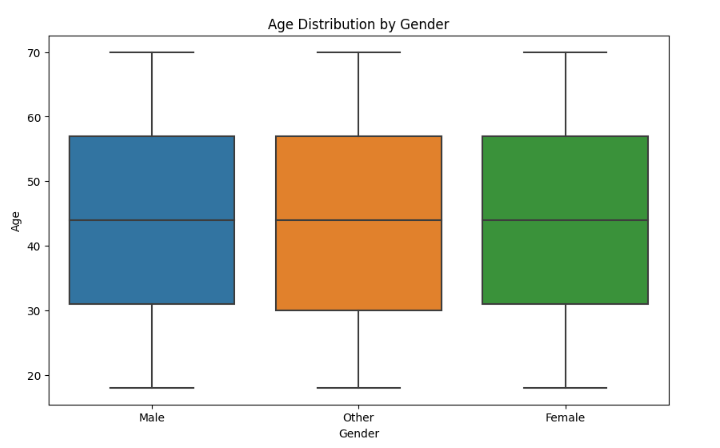
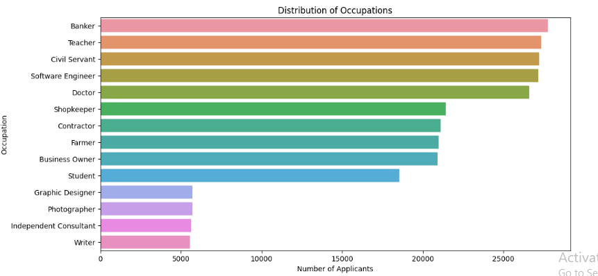
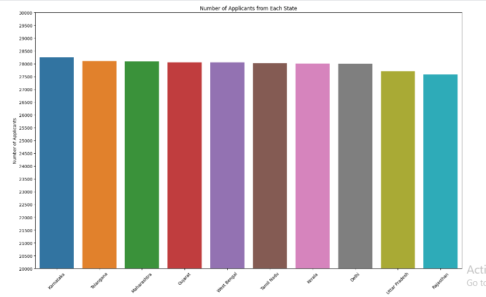

# Credit Score Prediction

## Project Overview

This project aims to predict credit scores for two-wheeler loan applicants using various machine learning models. The project utilizes a dataset of **100,000** credit profiles, including applicant demographics, financial information, and loan details. By leveraging machine learning techniques, the project seeks to develop a robust model for accurate credit score prediction, achieving an **RMSE below 5** (representing the average error in credit score prediction).

## Dataset

The dataset used in this project contains information about **100,000** two-wheeler loan applicants, including the following features:

- **Age:** Applicant's age (ranging from **18 to 70**).
- **Gender:** Applicant's gender (**Male, Female, Other**).
- **Income:** Applicant's income (in multiples of 1,000, e.g., **1,000; 2,000; 3,000**, and so on).
- **Credit History Length:** Length of the applicant's credit history (in months).
- **Number of Existing Loans:** Number of existing loans the applicant has (ranging from **0 to 10**).
- **Loan Amount:** Amount of the loan applied for (ranging from **0 to 150,000**).
- **Loan Tenure:** Duration of the loan (in months).
- **Existing Customer:** Whether the applicant is an existing customer (**Yes, No**).
- **State & City:** Applicant's location (covering **29 states and 319 cities** in India).
- **LTV Ratio:** Loan-to-value ratio (ranging from **40% to 95%**).
- **Employment Profile:** Applicant's employment type (**Salaried, Self-Employed, Freelancer, Unemployed, Student**).
- **Occupation:** Applicant's occupation (**over 50 unique occupations**).
- **Profile Score:** Applicant's profile score (ranging from **0 to 100**).

## Models Used

The project explores the following machine learning models for credit score prediction:

- **Linear Regression:** A simple linear model.
- **Decision Tree:** A tree-based model for non-linear relationships, with a maximum depth of **50**.
- **Random Forest:** An ensemble of **160** decision trees for improved accuracy.
- **Stacking Ensemble:** A combination of **Linear Regression, Random Forest, and Decision Tree** models for enhanced performance.
- **XGBoost:** A gradient boosting algorithm known for its efficiency, using **40 estimators** and a learning rate of **0.7**.
- **ANN:** Artificial Neural Network with **2 hidden layers**, each containing **6 neurons**, for complex pattern recognition, trained for **50 epochs** with a batch size of **32**.

## Data Preprocessing

Before training the machine learning models, the dataset underwent several preprocessing steps to ensure data quality and improve model performance. These steps included:

**1. Handling Missing Values:**

-   Initial analysis revealed **1,000** missing values in the 'Occupation' column. These missing values were strategically imputed with 'None' where the 'Employment Profile' was 'Unemployed', as it was logical to assume unemployed individuals would not have an occupation listed. This imputation resulted in a **100% complete dataset** with no missing values.

**2. Feature Encoding:**

-   **6 categorical columns** ('Gender', 'State', 'City', 'Occupation', 'Employment Profile', 'Existing Customer') were identified. To enable their use in machine learning models, **one-hot encoding** was applied. This transformed the categorical features into numerical representations, creating **over 400 new columns** representing the various categories.

**3. Feature Scaling:**

-   **8 numerical features** ('Income', 'Age', 'Credit History Length', 'Number of Existing Loans', 'Loan Amount', 'Loan Tenure', 'LTV Ratio', 'Profile Score') were scaled using **Min-Max normalization**. This ensured all numerical features were within the range of 0 to 1, preventing features with larger values from dominating the model training process and improving model stability.

**4. Feature Engineering:**

-   A new feature, **'Income_to_Loan_Ratio'**, was engineered by dividing 'Income' by 'Loan Amount'. This feature represents the applicant's ability to repay the loan and was scaled using **Min-Max normalization** to maintain consistency with other numerical features.

These preprocessing steps significantly enhanced the quality and suitability of the dataset for machine learning model training, ultimately contributing to improved model performance and accuracy.
### EDA Visualizations

This bar chart shows the distribution of loan applicants by gender.

This boxplot illustrates the age distribution of loan applicants by gender.

This Barplot illustrates the Occupation distribution of loan applicants .

This Barplot illustrates the Statewise distribution of loan applicants .

## Evaluation Metrics and Results

The models are evaluated using the **Mean Squared Error (MSE)** and **Root Mean Squared Error (RMSE)** metrics. The following table summarizes the results:

| Model | MSE | RMSE |
|---|---|---|
| Linear Regression | 259.57 | 16.11 |
| Decision Tree | 53.05 | 7.28 |
| Random Forest | 41.45 | 0.43 |
| Stacking Ensemble | 95.92 | 9.79 |
| XGBoost | 127.88 | 11.30 |

## Conclusion

The project provides a comprehensive analysis of credit score prediction for two-wheeler loan applicants. Based on the evaluation metrics, the **Random Forest** and **Stacking Ensemble** models demonstrated the best performance with the lowest RMSE values. These models can be further fine-tuned and deployed for accurate and efficient credit score estimation, facilitating faster and more informed loan approval decisions.

## Requirements

To run the code in this project, you'll need the following libraries installed:

- Python 3.11
- pandas==1.5.3
- NumPy==1.24.3
- scikit-learn==1.2.2
- seaborn==0.12.2
- matplotlib==3.7.1
- XGBoost==1.7.5

